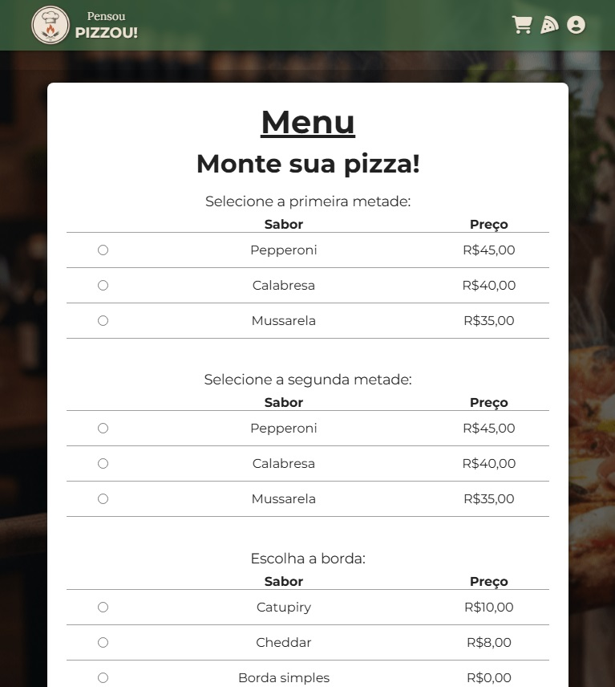

<h1 align="center" style="font-weight: bold;">Pensou Pizzou 🍕</h1>

<p align="center">
 <a href="#tech">Technologies</a> • 
 <a href="#started">Getting Started</a> 
</p>

<p align="center">
    <b>It's a project to buy pizzas and manage the avaiable flavors.</b>
</p>

<p align="center">
     <a href="https://pizzaria-black.vercel.app/">📱 Visit "Pensou Pizzou!"</a>
</p>

<h2 id="layout">🎨 Layout</h2>

<p align="center">
    
    
</p>


<h2 id="technologies">💻 Technologies</h2>


<h2 id="features">✨ Features</h2>

- 🍕 View the list of available pizzas and flavors  
- 🧀 Add/remove flavors dynamically  
- 👤 User authentication (login and signup)  
- 🧩 Admin area to edit, delete and manage flavors  
- 🌐 Responsive layout for all devices  

<h2 id="started">🚀 Getting Started</h2>

Follow the steps below to run the project locally.

### Prerequisites

Make sure you have installed:

- [Node.js](https://nodejs.org/)
- [Git](https://git-scm.com/)

### Cloning

```bash
git clone https://github.com/michaelcostaribeiro/pizzaria.git
```

<h3>Starting</h3>

How to start the project

```bash
cd pizzaria
npm run dev
```


<h2>📄 License</h2>

This project is under the MIT License.